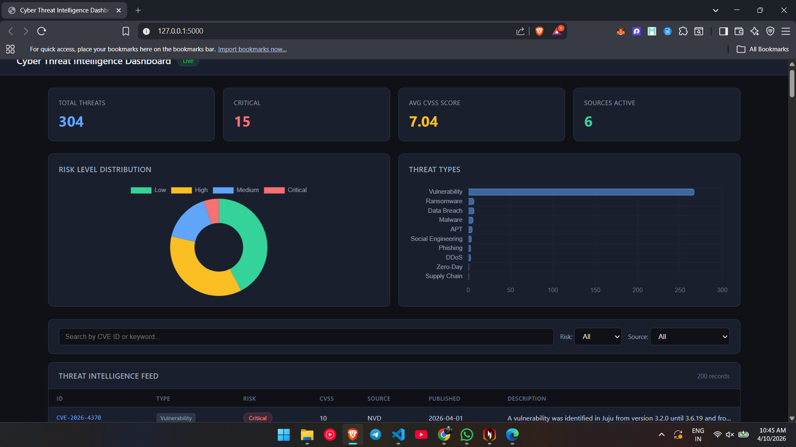

# Cyber Threat Intelligence Agent

An AI-powered cybersecurity threat intelligence system that
automatically fetches, classifies, and visualizes real-world
threats from live data sources.

## Features

- Fetches 300+ real CVEs daily from NVD, CISA, and security news
- AI threat classification using HuggingFace zero-shot NLP
- Composite risk scoring (Low / Medium / High / Critical)
- Named entity extraction — CVE IDs, IPs, affected vendors
- Live Flask web dashboard with charts and filters
- Fully automated pipeline — one command runs everything

## Tech Stack

| Layer | Technology |
|---|---|
| Language | Python 3.11 |
| Data fetching | requests, feedparser |
| Data processing | pandas, SQLite |
| AI classification | HuggingFace Transformers (bart-large-mnli) |
| NLP extraction | spaCy (en_core_web_sm) |
| Web dashboard | Flask, Chart.js |
| Scheduling | APScheduler |

## Data Sources

| Source | What it provides |
|---|---|
| NVD API v2 | All published CVEs with CVSS scores |
| CISA KEV | Actively exploited vulnerabilities |
| BleepingComputer | Security news RSS |
| The Hacker News | Security news RSS |
| Krebs on Security | Security news RSS |

## Project Structure